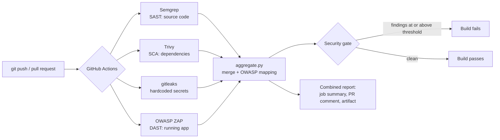

# DevSecOps Pipeline on OWASP NodeGoat


An automated security gate that scans every code change at four layers, blocks vulnerable code, and tracks each issue until it is fixed.

The target is [OWASP NodeGoat](https://github.com/OWASP/NodeGoat), a deliberately vulnerable Node.js web app built to teach the OWASP Top 10. On every push and pull request, GitHub Actions runs four security scanners against it. A Python script merges their results into one report and decides whether the build passes.

## How it works



The four scanners run in parallel, and each covers a layer the others can't see:

| Scanner | Type | What it checks | Example in NodeGoat |
| --- | --- | --- | --- |
| [Semgrep](https://semgrep.dev) | SAST (static analysis) | Insecure patterns in our source code | User input reaching a database query or `eval` |
| [Trivy](https://trivy.dev) | SCA (dependency scanning) | npm packages with known CVEs | The old `marked` 0.3.5 pinned in `package.json` |
| [gitleaks](https://github.com/gitleaks/gitleaks) | Secret scanning | Passwords, keys and tokens committed to the repo | Hardcoded keys in `app/config/env/` |
| [OWASP ZAP](https://www.zaproxy.org) | DAST (dynamic analysis) | The live app over HTTP, the way a browser sees it | Missing security headers, insecure cookie flags |

ZAP needs a running app, so that job starts NodeGoat and MongoDB with Docker Compose inside the runner, scans `http://localhost:4000`, then shuts it down.

## The security gate

`scripts/aggregate.py` is the part we wrote ourselves. It:

1. Reads all four reports (three SARIF files and ZAP's JSON)
2. Converts each finding into one common format: scanner, rule, severity, location, CWE, OWASP Top 10 category
3. Removes duplicates and sets aside findings the team has formally accepted
4. Produces one combined report as a Markdown summary (shown on the Actions run page and as a pull request comment) and a JSON file
5. **Fails the build** if any open finding is at or above the policy severity

**Policy.** Set by `FAIL_ON` in [`.github/workflows/security.yml`](.github/workflows/security.yml). The default is `high`, which fails on any High or Critical finding. Options: `critical`, `high`, `medium`, `low`, `never`.

**Fails closed.** If a scanner crashes and produces no report, the gate fails. A broken scanner must never look like a clean scan.

**Accepted risks.** Some findings are false positives or are deliberately accepted. Record those in [`.security/accepted-risks.json`](.security/accepted-risks.json) with a reason, so they're visible and reviewed rather than silently ignored:

```json
{
  "accepted": [
    {
      "tool": "zap",
      "rule_id": "10036",
      "location": "http://localhost:4000/*",
      "reason": "Server version header is set by the demo container, not the app",
      "expires": "2026-12-31"
    }
  ]
}
```

`tool` and `rule_id` must match the report exactly. `location` is a glob and defaults to `*`. After the `expires` date the entry stops applying, so acceptances get re-reviewed. Accepted findings still appear in the report in their own section.

## Repository structure

```
.github/workflows/security.yml   the pipeline: 4 scan jobs + the gate job
scripts/aggregate.py             merges reports, maps to OWASP, applies the gate
scripts/tests/                   unit tests for the aggregator (run in CI before the gate)
.security/accepted-risks.json    reviewed and accepted findings, with reasons
.semgrepignore                   third-party code excluded from SAST
app/                             OWASP NodeGoat (the target application)
docs/findings-log.md             triage log: every finding, verdict and fix
reports/                         saved before/after reports for the write-up
```

## Running it

**On GitHub.** Push to `main` or open a pull request. Open the **Actions** tab, select the run, and the combined report is on the run's summary page. Full reports are under **Artifacts**. When the repo is public, Semgrep, Trivy and gitleaks findings also appear in the **Security → Code scanning** tab.

**The app locally** (needs Docker):

```bash
cd app && docker compose up --build
```

Then open <http://localhost:4000>. NodeGoat's README in `app/` lists the demo login accounts.

**The aggregator locally** (Python 3.10+, no packages needed). Download the `security-report` artifact from a run, unzip it, then:

```bash
python3 scripts/aggregate.py --results results --accepted .security/accepted-risks.json --fail-on high
```

```bash
python3 -m unittest discover -s scripts/tests -v
```

## Project workflow

1. **Baseline.** The first run on unmodified NodeGoat fails. Save its report to `reports/before/`.
2. **Triage.** Go through each finding in [`docs/findings-log.md`](docs/findings-log.md): is it real, which OWASP category, how severe?
3. **Fix.** One vulnerability per commit, with the finding referenced in the commit message (for example `fix(A06): upgrade marked to patched version`). Each push re-runs the pipeline, so the report shows progress.
4. **Accept.** False positives and deliberate exceptions go in `accepted-risks.json` with a reason. They are not deleted.
5. **Green.** When the gate passes, save that report to `reports/after/` for the before/after comparison.

## Scope and ethics

All scanning targets our own copy of NodeGoat, running inside the GitHub Actions runner or on our own machines. ZAP runs a passive baseline scan against `localhost` only. No external systems are scanned.

## Credits

- **NodeGoat** © OWASP Foundation, licensed under the Apache License 2.0. The full source is in `app/` with its original [`LICENSE`](app/LICENSE). Upstream CI configuration (`app/.github/`) was removed because this repo has its own pipeline. All other changes to `app/` are security fixes made as part of this project and are visible in the commit history.
- OWASP Top 10 mapping uses the 2021 edition and the CWE lists OWASP publishes for each category.
